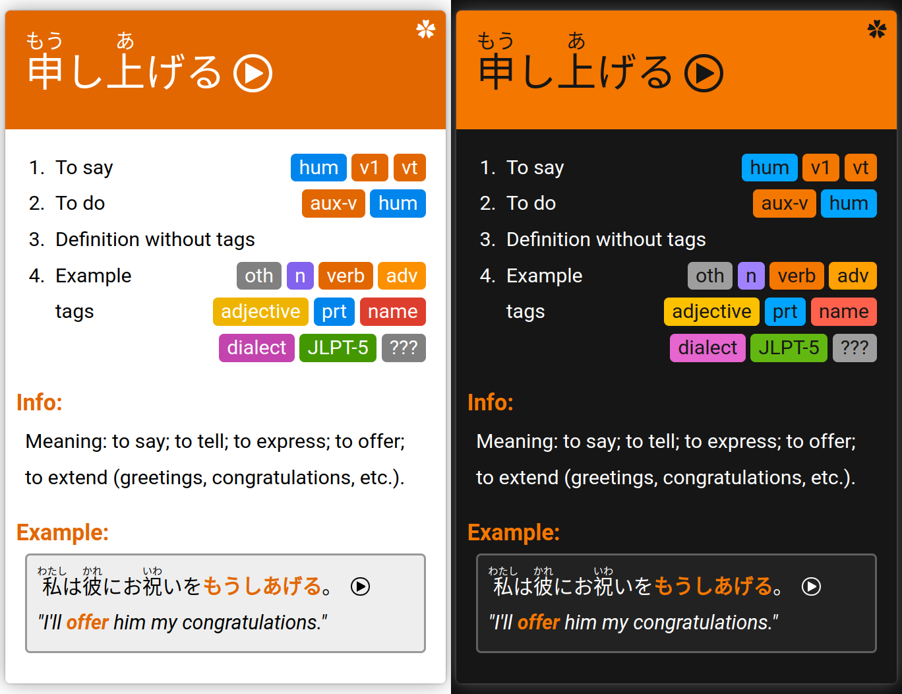
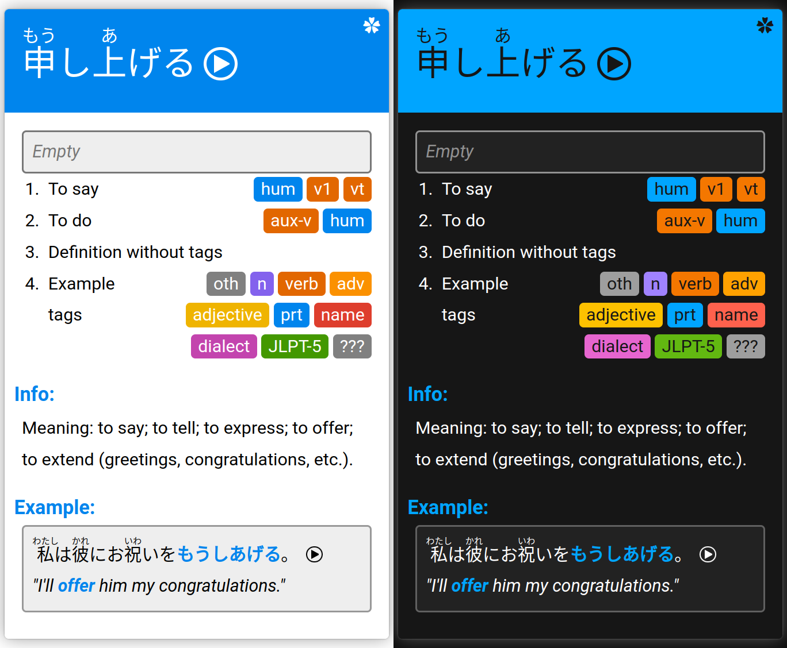
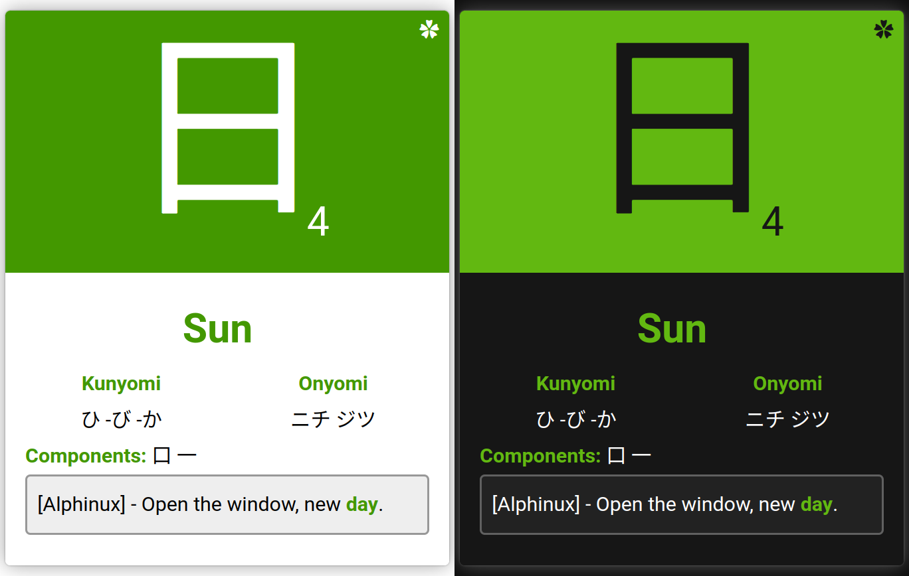

# JPCards



## About

JPCards is a collection of custom Anki cards made for learning the japanese language.

## Demo

JPCards have a interactive demo that can be accessed [here](https://ertingel.github.io/JPCards/Demo/).

## Download

JPCards can be downloaded [here](https://github.com/Ertingel/JPCards/raw/main/JPCards.colpkg).

> [!IMPORTANT]
> Text input on JPCards does not work on AnkiWeb.

### Install

1. Download [JPCards.colpkg](https://github.com/Ertingel/JPCards/raw/main/JPCards.colpkg).

2. In Anki:

    1. Choose _File > Import_.

    2. Select the _JPCards.colpkg_ file.

    3. (Optional) Remove included demo notes in the card browser.

3. Done. (You can now create new notes with the JPCards note type)

> [!IMPORTANT]
> Text input on JPCards does not work on AnkiWeb.

Additional information on importing in Anki can be found [here](https://docs.ankiweb.net/importing/packaged-decks.html).

## Development

### Visual Studio Code

JPCards is developed using [Visual Studio Code](https://code.visualstudio.com/) with the following extensions:

-   [Live Server](https://marketplace.visualstudio.com/items?itemName=ritwickdey.LiveServer)
-   [Live Sass Compiler](https://marketplace.visualstudio.com/items?itemName=glenn2223.live-sass)
-   [Prettier](https://marketplace.visualstudio.com/items?itemName=esbenp.prettier-vscode)

### Build

#### Prerequisites

The prerequisites for building JPCards are the following:

-   [Node](https://nodejs.org/en/download)
-   [Anki](https://apps.ankiweb.net/)
-   [AnkiConnect](https://ankiweb.net/shared/info/2055492159)

#### Build Process

The build process is the following:

1. Start Anki.

2. Configure AnkiConnect. (Can be skipped if fresh install)

    1. _Tools > Add-ons_

    2. select _AnkiConnect_ and then click _Config_

    3. Replace with the following:

        ```json
        {
        	"apiKey": null,
        	"apiLogPath": null,
        	"ignoreOriginList": [],
        	"webBindAddress": "127.0.0.1",
        	"webBindPort": 8765,
        	"webCorsOriginList": ["http://localhost"]
        }
        ```

3. Download and extract the [project](https://github.com/Ertingel/JPCards/archive/refs/heads/main.zip).

4. Enter the project folder

5. Run `node build.js`

6. (Optional) Remove included demo notes in the card browser.

7. Done. (You can now create new notes with the JPCards note type)

> [!IMPORTANT]
> JPCards does not work on AnkiWeb.

## Gallery

### Forward


### Reverse



### Kanji


